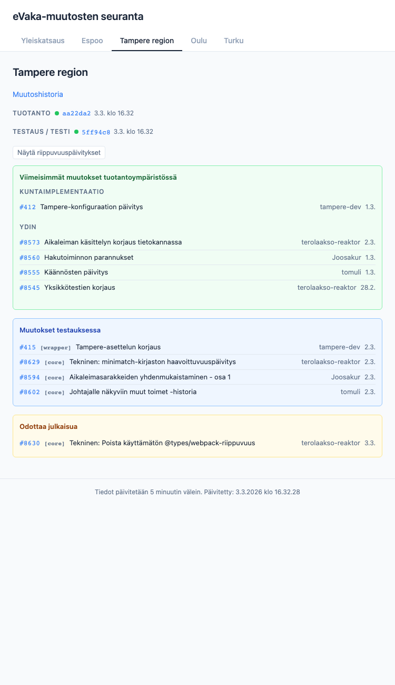

# eVaka-muutosten seuranta

**[Avaa seurantanäkymä](https://espoon-voltti.github.io/evaka-update-tracker/)**

Seurantanäkymä, joka näyttää mitkä Pull Requestit on asennettu eri eVaka-instansseihin suomalaisissa kunnissa. Ajastettu GitHub Action hakee asennetut versiot, selvittää PR:t GitHub API:n kautta, tunnistaa muutokset, lähettää Slack-ilmoitukset ja tuottaa staattisen hallintapaneelin GitHub Pagesiin.



## Seuratut kunnat

| Kunta | Repositorio | Tuotanto | Testaus |
|-------|------------|----------|---------|
| **Espoo** | [espoon-voltti/evaka](https://github.com/espoon-voltti/evaka) (ydin) | espoonvarhaiskasvatus.fi | `STAGING_INSTANCES`-ympäristömuuttujan kautta |
| **Tampereen seutu** | [Tampere/trevaka](https://github.com/Tampere/trevaka) (Kuntaimplementaatio) | varhaiskasvatus.tampere.fi + 8 kuntaa | `STAGING_INSTANCES`-ympäristömuuttujan kautta |
| **Oulu** | [Oulunkaupunki/evakaoulu](https://github.com/Oulunkaupunki/evakaoulu) (Kuntaimplementaatio) | varhaiskasvatus.ouka.fi | `STAGING_INSTANCES`-ympäristömuuttujan kautta |
| **Turku** | [City-of-Turku/evakaturku](https://github.com/City-of-Turku/evakaturku) (Kuntaimplementaatio) | evaka.turku.fi | `STAGING_INSTANCES`-ympäristömuuttujan kautta |

4 kuntaryhmää, joiden tuotantoinstanssit on kovakoodattu ja testaus-/testiympäristöt konfiguroidaan ympäristömuuttujalla. Kuntaimplementaatioiden kunnat seuraavat sekä kuntakohtaisia että ydin-eVakan PR:iä erikseen.

## Toimintaperiaate

1. **5 minuutin välein** GitHub Action kyselee kunkin instanssin `/api/citizen/auth/status`-päätepistettä saadakseen asennetun commitin SHA:n
2. Kuntaimplementaatioiden osalta ydin-eVakan versio selvitetään git-submoduuliviittauksen kautta
3. PR:t edellisen ja nykyisen asennetun version väliltä kerätään GitHub Compare API:lla
4. Versiomuutokset laukaisevat Slack-ilmoitukset Block Kit -viesteillä
5. Repositorioiden oletushaarojen uudet PR:t ilmoitetaan minimaalisilla Slack-viesteillä (ydin- ja kuntaimplementaatiot omille kanavilleen)
6. Tulokset kirjoitetaan JSON-tiedostoihin (`data/current.json`, `data/history.json`, `data/previous.json`) ja commitoidaan repositorioon
7. Staattinen hallintapaneeli (`site/`) julkaistaan GitHub Pagesiin datatiedostojen rinnalle

## Hallintapaneelin ominaisuudet

- **Yleiskatsaus** — kaikki kunnat yhdellä silmäyksellä tuotanto-/testausversioiden ja viimeaikaisten PR:ien kanssa
- **Kunnan tiedot** — kuntakohtainen näkymä ympäristöjen tiloilla, Kuntaimplementaatio/ydin-PR-raidoilla ja instanssien tiedoilla
- **PR-tilan seuranta** — näe onko PR yhdistetty, testauksessa vai tuotannossa
- **Muutoshistoria** — aikajärjestyksessä oleva loki muutoksista ja niihin sisältyvistä PR:istä
- **Automaatio-PR-suodatin** — suodata Dependabot- ja Renovate-PR:t näkyviin tai piiloon
- **Syvälinkit** — hash-pohjaiset URL:t kirjanmerkkejä varten (`#/city/espoo`, `#/city/tampere-region/history`)

## Edellytykset

- Node.js 20+
- GitHub PAT `public_repo`-oikeudella (5 000 pyyntöä/tunti)

## Asennus

```bash
npm install

cp .env.example .env
# Muokkaa .env ja aseta GH_TOKEN (pakollinen), sekä valinnaiset SLACK_WEBHOOK_URL, STAGING_INSTANCES ja Oulun testausympäristön tunnukset
```

## Kehitys

```bash
# Suorita tiedonhakija dry-run-tilassa (tulostaa, ei kirjoita tiedostoja eikä lähetä Slackiin)
DRY_RUN=true npx ts-node --esm src/index.ts

# Suorita koko putki (kirjoittaa datatiedostot, lähettää Slack-ilmoitukset)
npx ts-node --esm src/index.ts

# Esikatsele hallintapaneelia paikallisesti
ln -sf ../data site/data
npx serve site
# Avaa http://localhost:3000

# Suorita testit
npm test

# Tyyppitarkistus
npx tsc --noEmit

# Ota kuvakaappaus hallintapaneelista
npm run screenshot -- --path "#/city/tampere-region" --width 750 --height 1300
```

## Projektin rakenne

```
src/                              # Tiedonhakija (TypeScript)
├── config/instances.ts           # Kuntaryhmät, repositoriot, ympäristöt, instanssit
├── api/
│   ├── github.ts                 # GitHub REST API -asiakas ETag-välimuistilla
│   ├── status.ts                 # Instanssin version hakija
│   └── slack.ts                  # Slack webhook -asiakas (Block Kit)
├── services/
│   ├── version-resolver.ts       # Asennetun version + submoduulin selvitys
│   ├── pr-collector.ts           # PR:ien keruu Compare API:lla
│   ├── change-detector.ts        # Versiomuutosten tunnistus
│   ├── change-announcer.ts       # Repositoriomuutosten Slack-ilmoitukset
│   ├── history-manager.ts        # Muutoshistorian luku/kirjoitus/karsinta
│   └── site-deployer.ts          # Sivuston + datan kopiointi dist/-kansioon
├── utils/
│   ├── retry.ts                  # Uudelleenyritys eksponentiaalisella viiveellä
│   └── pr-classifier.ts          # PR:ien luokittelu ihminen vs. automaatio
├── types.ts                      # Jaetut TypeScript-rajapinnat
└── index.ts                      # Putken orkestroija

site/                             # Staattinen käyttöliittymä (vanilla JS, ei riippuvuuksia)
├── index.html
├── css/style.css
└── js/
    ├── app.js                    # Alustus, datan lataus, reititys
    ├── router.js                 # Hash-pohjainen reititin
    └── components/
        ├── overview.js           # Kaikkien kuntien yleiskatsausruudukko
        ├── city-tabs.js          # Kuntavälilehdet
        ├── city-detail.js        # Yksittäisen kunnan tietonäkymä
        ├── pr-list.js            # PR-listaus tilamerkinnöillä
        ├── status-badge.js       # Ympäristön tilaindikaattorit
        └── history-view.js       # Muutoshistorian aikajana

data/                             # Tallennettu tila (GitHub Action commitoi)
├── current.json                  # Täydellinen muutosten tilannekuva
├── history.json                  # Muutostapahtumat (1 kk:n liukuva ikkuna)
├── previous.json                 # Edellisen ajon SHA:t muutosten tunnistamiseen
└── repo-heads.json               # Repositorioiden oletushaarojen HEAD-SHA:t muutosilmoituksia varten

tests/
├── unit/                         # Yksikkötestit (Jest)
├── integration/                  # Integraatiotestit (nock)
└── fixtures/                     # Esimerkki-API-vastaukset ja datatiedostot

.github/workflows/monitor.yml     # Ajastettu työnkulku (5 min välein)
```

## Ympäristömuuttujat

| Muuttuja | Pakollinen | Kuvaus |
|----------|------------|--------|
| `GH_TOKEN` | Kyllä | GitHub PAT API-käyttöön (5 000 pyyntöä/tunti) |
| `SLACK_WEBHOOK_URL` | Ei | Slack incoming webhook asennusilmoituksille |
| `SLACK_CHANGE_WEBHOOK_CORE` | Ei | Slack webhook ydin-repositorioon yhdistettyjen PR:ien ilmoituksille |
| `SLACK_CHANGE_WEBHOOK_<KUNTA>` | Ei | Slack webhook kuntaimplementaation PR-ilmoituksille (esim. `SLACK_CHANGE_WEBHOOK_TAMPERE_REGION`) |
| `STAGING_INSTANCES` | Ei | JSON-taulukko testaus-/testiympäristöjen instansseista (katso `.env.example`) |
| `OULU_STAGING_USER` | Ei | HTTP basic auth -käyttäjänimi Oulun testausympäristölle |
| `OULU_STAGING_PASS` | Ei | HTTP basic auth -salasana Oulun testausympäristölle |
| `DRY_RUN` | Ei | Aseta `true` ohittaaksesi tiedostokirjoitukset ja Slack-lähetykset |

## Julkaisu

GitHub Actions -työnkulku (`.github/workflows/monitor.yml`) suoritetaan automaattisesti:

1. Hakee versiot kaikista konfiguroiduista instansseista
2. Selvittää PR:t ja tunnistaa muutokset
3. Lähettää Slack-ilmoitukset muutoksista
4. Commitoi päivitetyt datatiedostot
5. Julkaisee hallintapaneelin GitHub Pagesiin

**Vaadittu asennus:** Repository Settings → Pages → Source: "GitHub Actions". Lisää salaisuudet `GH_TOKEN` ja valinnaisesti `SLACK_WEBHOOK_URL`, `SLACK_CHANGE_WEBHOOK_CORE`, `SLACK_CHANGE_WEBHOOK_<KUNTA>`, `STAGING_INSTANCES`, `OULU_STAGING_USER`, `OULU_STAGING_PASS`.

## Testit

```bash
npm test        # 171 testiä 18 sarjassa
```

- **Yksikkötestit** — version selvitys, PR:ien keruu, muutosten tunnistus, PR:ien luokittelu, muutoshistorian hallinta
- **Integraatiotestit** — GitHub API, status API, Slack API (kaikki nock-HTTP-mockauksella)
